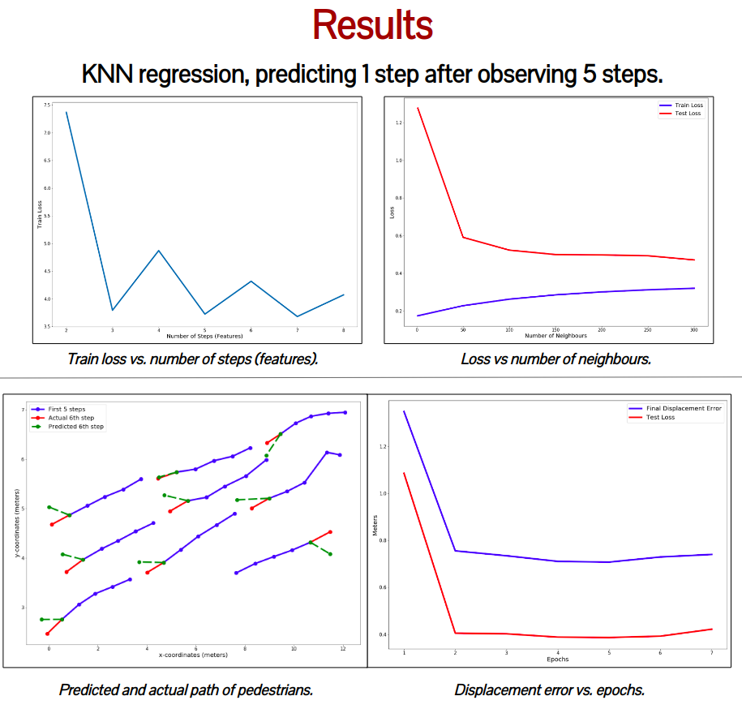
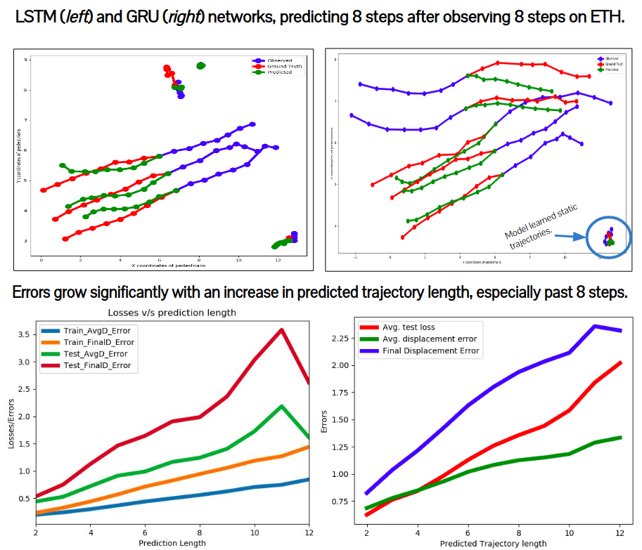
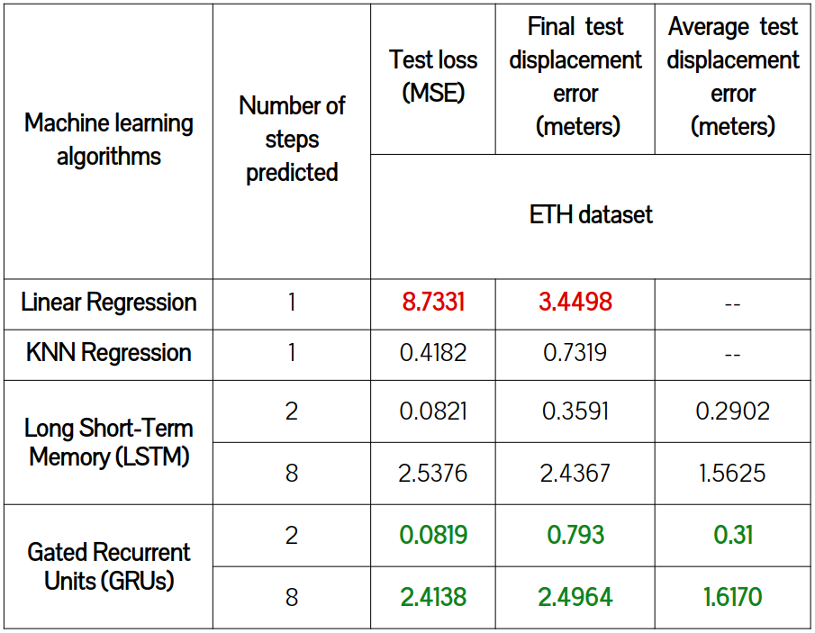

# Pedestrian_Trajectory_Prediction
Implementation of Recurrent Neural Networks for future trajectory prediction of pedestrians. 
Modeling the interactions between autonomous vehicles (AVs) and pedestrians is currently a critical issue for public safety and predictive modeling. Accurate predictions of pedestrian trajectories would allow AVs to safely navigate around pedestrians in crowded scenarios. In this paper, both traditional machine learning algorithms (linear regression, KNN regression) and deep learning frameworks (Vanilla LSTM, GRU) have been used  to predict future steps, in the form of spatial trajectories, of various pedestrians based on their previous trajectories. The proposed methods have been evaluated on publicly available datasets and then we use Mean Square Error (MSE) loss, final displacement error and average displacement error as the metrics for performance. Finally, a study on the influence of observed trajectory length and predicted trajectory length on prediction accuracy is presented. LSTM and GRU: LSTM and GRU outperformed both the traditional machine learning algorithms for predicting any number of frames with the same or higher observed trajectory length.
Further details can be found in the attahced Project Report.  
The latest models and scripts are located at RNN/data/  

Thanks to Anirudh Vemula (https://github.com/vvanirudh) for the dataloader.
